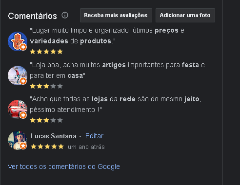
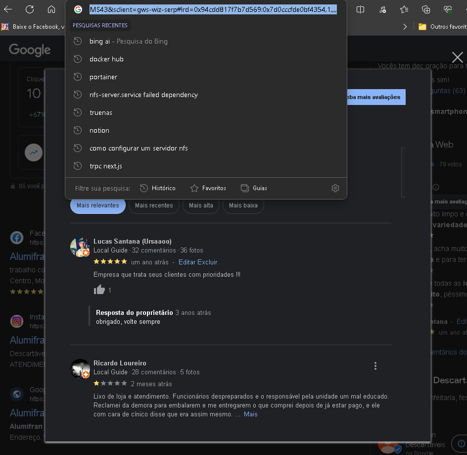

Google Comments

*Esse Aplicativo Foi criado para Capturar comentarios da sua empresa e poder retornar em Json para Manipulação em seu codigo Front-end*


```dockerfile
docker run -p 3001:3001 luuhsantanafs/googlecomments
```

para consultar vc deve mandar um POST para rota http://localhost:3001/scrapper e no Body tem que conter a tag 'url' com o link da empresa do google conforme a imagem abaixo 

* Clique em "Ver Todos os Comentarios do Google"

 


* Depois Copia a url 

 Copie a url 


```javascript	
const data = JSON.stringify({
  "url": "https://www.google.com/search?q=jonife&sca_esv=6895027673ed6d92&sxsrf=ACQVn0-mgd4rdSwbcY9c1O13g1zcRRlq_A%3A1708806115203&ei=40_aZaeEDJD85OUP2I20-AU&udm=&ved=0ahUKEwjngfLr5sSEAxUQPrkGHdgGDV8Q4dUDCBA&uact=5&oq=jonife&gs_lp=Egxnd3Mtd2l6LXNlcnAiBmpvbmlmZTIEECMYJzIKEC4YgAQYChixAzINEC4YChiDARixAxiABDINEC4YgAQYChixAxiDATIKEC4YgAQYChixAzINEC4YgAQYChixAxiDATINEC4YgAQYChixAxiDATINEC4YgAQYChixAxiDATIKEC4YgAQYChixAzINEAAYgAQYChixAxiDAUitB1AAWLAGcAB4AZABAJgBhQGgAa8FqgEDMC42uAEDyAEA-AEBmAIGoALLBcICChAjGIAEGIoFGCfCAgsQABiABBixAxiDAcICCBAAGIAEGLEDwgIOEC4YgAQYigUYsQMYgwHCAgUQABiABMICCxAuGIAEGLEDGIMBwgIIEC4YgAQYsQPCAgUQLhiABMICDhAuGIAEGMcBGK8BGI4FwgILEC4YgAQYxwEYrwGYAwCSBwMwLjY&sclient=gws-wiz-serp#ip=1&lrd=0x94ce77f31a046f0b:0xae7cd526d10f6ca9,1,,,,"
});

* aqui ta um exemplo de post para o app

const xhr = new XMLHttpRequest();
xhr.withCredentials = true;

xhr.addEventListener("readystatechange", function () {
  if (this.readyState === this.DONE) {
    console.log(this.responseText);
  }
});

xhr.open("POST", "http://localhost:3001/scrapper");
xhr.setRequestHeader("Content-Type", "application/json");
xhr.setRequestHeader("User-Agent", "insomnia/8.6.1");

xhr.send(data);
```


